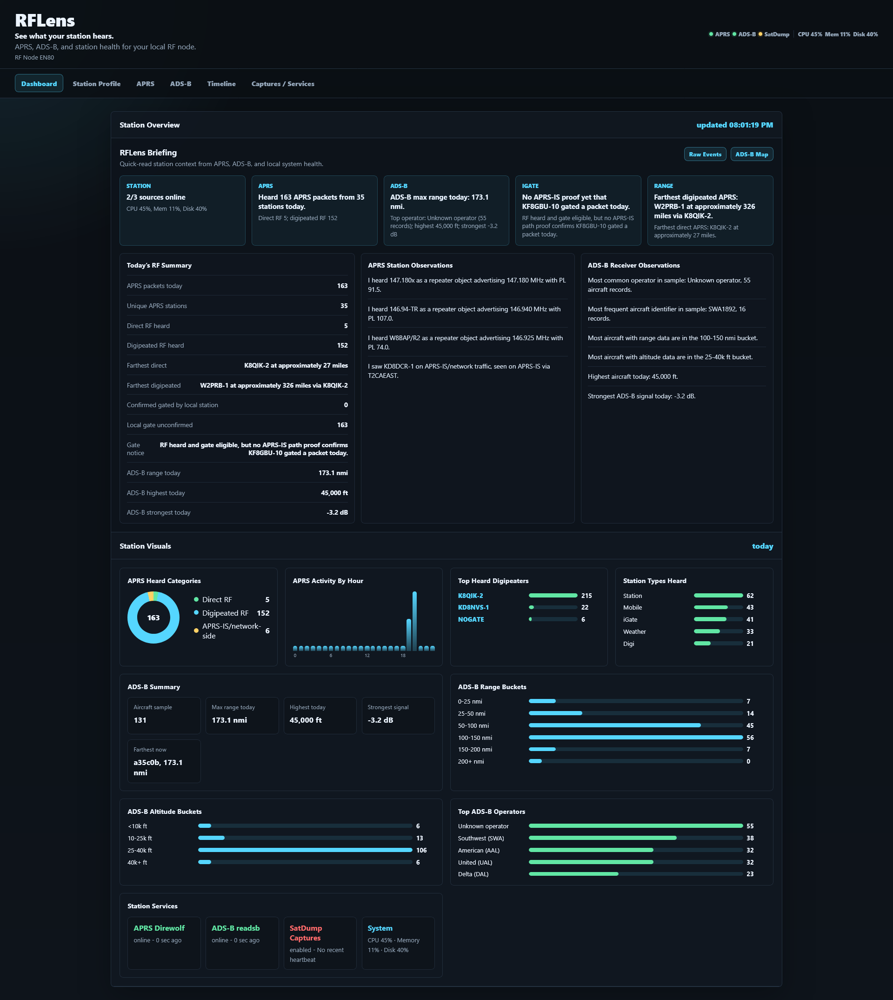
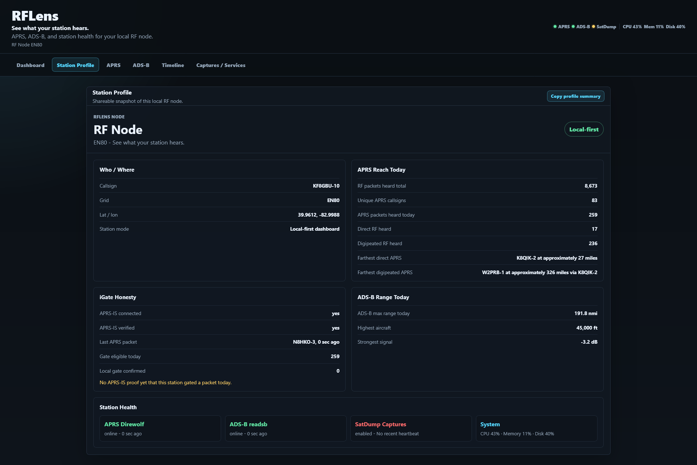
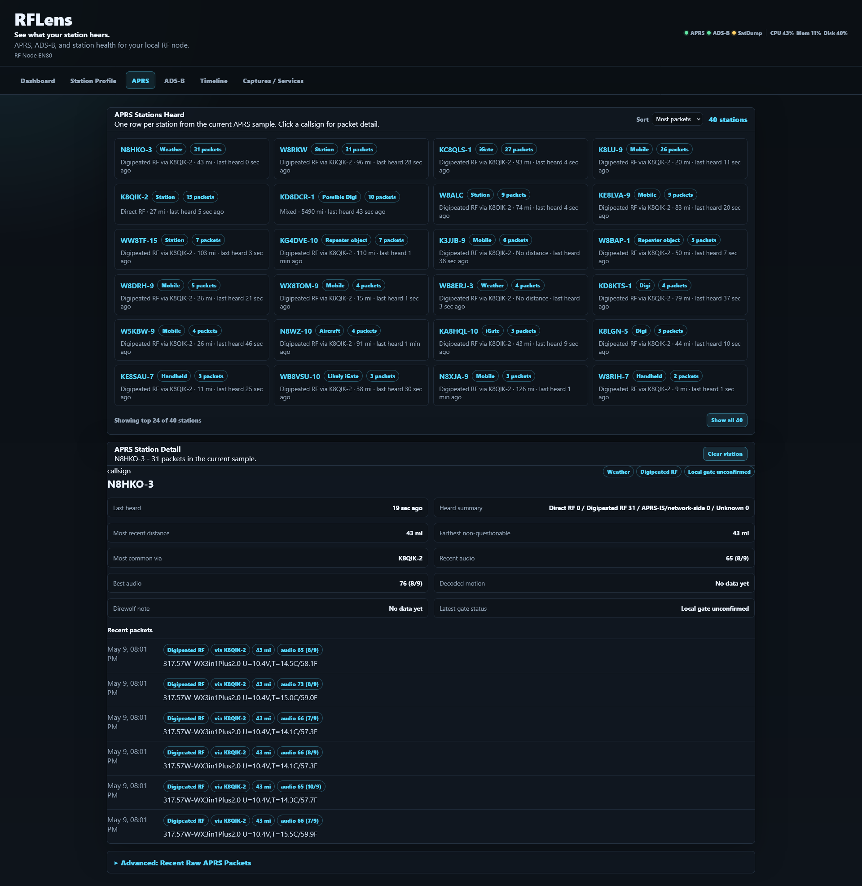
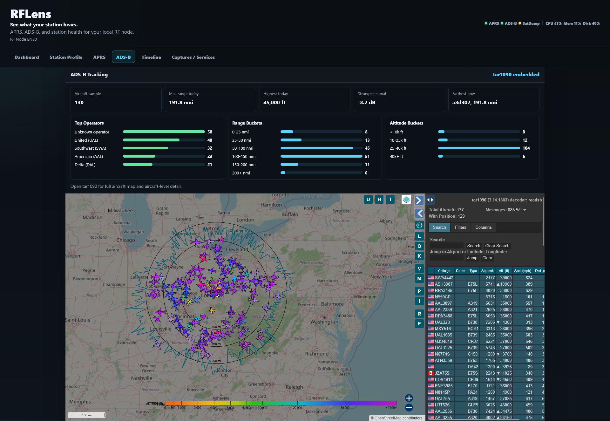
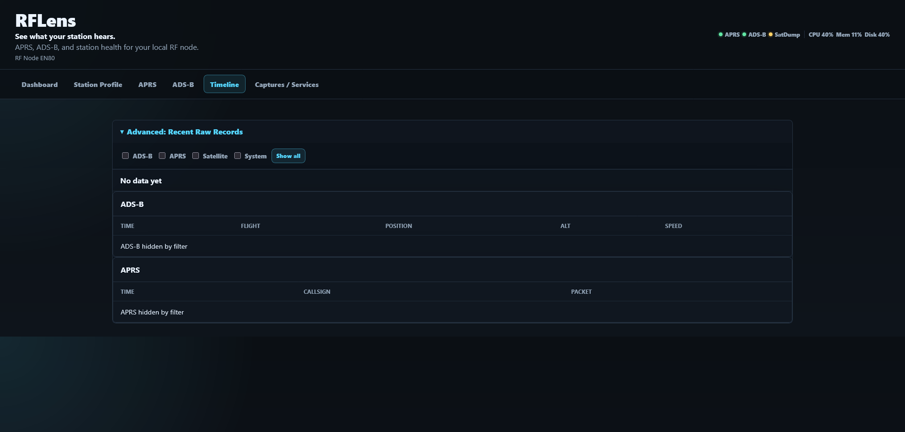

# RFLens

**See what your station hears.**

[](#current-status)
[](https://github.com/gregapackard/rflens/releases)
[](LICENSE)
[](https://github.com/gregapackard/rflens/issues)
[](#first-30-minutes)
[](https://fastapi.tiangolo.com/)
[](https://www.sqlite.org/)
[](#privacy-and-local-first)
[](https://github.com/wb2osz/direwolf)
[](https://github.com/wiedehopf/readsb)
[](https://www.satdump.org/)

RFLens is a local-first ham radio observability dashboard for APRS, ADS-B, and station health. It helps amateur radio operators see, measure, and improve their RF footprint using affordable hardware and open-source software.

> RFLens is early alpha software. It is currently best suited for technical users comfortable with Linux, Direwolf, readsb/tar1090, and editing YAML configuration files.

RFLens is ham-forward, station-forward, callsign-forward, club-demo-friendly, and focused on operating. It sits above local ham and RF tools and explains what the station is hearing.

## Why RFLens?

Most ham radio tools are excellent at one job: Direwolf decodes APRS, readsb/tar1090 handles ADS-B, and SatDump captures satellites. RFLens sits above those local tools and turns station activity into a clean operating dashboard.

RFLens is designed to answer practical station questions:

- What is my station hearing today?
- What was direct RF versus digipeated or network-side?
- How far is my APRS and ADS-B receive footprint?
- Are my local RF services healthy?
- What changed over time?

## What RFLens Is

- A local-first observability layer for ham radio stations and RF nodes.
- APRS station intelligence from Direwolf logs.
- Direct RF, digipeated RF, and APRS-IS/network-side separation.
- Honest iGate and gating proof language using APRS-IS path evidence when available.
- ADS-B receiver performance summaries from readsb/tar1090 aircraft data.
- Station health visibility for sources, CPU, memory, disk, and service state.
- A shareable Station Profile snapshot for club demos, station notes, and operating context.
- A dashboard for quick operating awareness.

## What RFLens Is Not

- RFLens is not a SIGINT suite.
- RFLens is not a scanner suite.
- RFLens is not a decode-everything SDR platform.
- RFLens is not an iNTERCEPT clone.
- RFLens is not a replacement for Direwolf, readsb, tar1090, SatDump, or OpenWebRX.
- tar1090 remains the full ADS-B aircraft map and detail view.
- RFLens focuses on receiver performance, station health, and notable observations.

## Current Status

RFLens is early alpha software.

Good fit right now:

- Linux users.
- Hams already running or willing to run Direwolf.
- Users with readsb/tar1090 for ADS-B.
- People comfortable editing YAML and systemd service files.

Not yet ideal for:

- One-click installs.
- Non-technical users.
- Public internet exposure without review.

## Alpha Testing

RFLens is looking for technical alpha feedback from hams running Linux-based RF nodes. See [ALPHA_TESTING.md](ALPHA_TESTING.md) for what to test and what information to include in reports.

## Features

- Local-first FastAPI dashboard.
- SQLite event history.
- APRS ingest from Direwolf logs.
- APRS station grid, sorting, show-more, and callsign drilldown.
- Direct RF vs digipeated RF vs APRS-IS/network-side classification.
- Conservative iGate confirmation using APRS-IS q-construct proof.
- Direwolf MIC-E follow-up enrichment when available.
- ADS-B summary from readsb aircraft data.
- tar1090 embed/link for the full ADS-B map view.
- Station Profile share snapshot.
- System/source health: CPU, memory, disk, APRS, ADS-B, and SatDump.
- No cloud dependency required.

## Screenshots

### Dashboard

Quick-read station briefing, APRS/ADS-B summaries, service health, and receiver visuals.



### Station Profile

A shareable snapshot of the local RF node, including APRS reach, ADS-B range, iGate honesty, and station health.



### APRS Stations Heard

Station-first APRS view with sorting, show-more behavior, and callsign drilldown.



### ADS-B Receiver Summary

ADS-B receiver performance summaries with tar1090 kept as the full aircraft map/detail view.



### Timeline / Advanced Records

Notable station timeline and advanced raw/debug record access.



## First 30 Minutes

This path gets RFLens running with station/system health only. APRS, ADS-B, and SatDump can stay disabled until their source tools are working.

```bash
git clone <your-rflens-repo-url> rflens
cd rflens
bash ./scripts/setup.sh
```

Edit the generated private config. At minimum, set your station name, callsign, grid, and location, or leave approximate placeholder location values for first API testing:

```bash
nano config.yaml
```

Run the setup check and start the API:

```bash
./venv/bin/python scripts/check_setup.py
bash ./scripts/run_api.sh
```

Open the dashboard:

```text
http://localhost:8080/ui
```

For a LAN node, use the host name or IP of the machine running RFLens, for example `http://rflens.local:8080/ui`.

RFLens is hostname-friendly. The frontend uses relative `/api/...` and `/ui/...` paths, so it works through DNS, mDNS, or a reviewed reverse proxy such as `http://rflens/`.

After the manual API run works, enable optional RF sources one at a time in `config.yaml`, rerun `scripts/check_setup.py`, and then start the matching ingestor. Treat systemd as the next step after manual startup is proven.

## Configuration

Copy `config.example.yaml` to `config.yaml` and edit it for your station. The example config is safe to commit and uses placeholders. Your real `config.yaml` is local/private and is ignored by Git.

Important fields:

- `station.name`: Human-readable station name.
- `station.callsign`: Your station callsign.
- `station.aprs_callsign`: APRS or iGate callsign, often with SSID.
- `station.grid`, `station.lat`, `station.lon`: Station location. Use the precision you are comfortable storing locally.
- `database_path`: SQLite database path.
- `server.host`, `server.port`: API bind address and port.
- `system.disk_path`: Optional path used for disk health reporting.
- `sources.aprs.enabled`: Enable the Direwolf log ingestor.
- `sources.aprs.log_path`: Direwolf text log path for RFLens to tail.
- `sources.adsb.enabled`: Enable the readsb aircraft ingestor.
- `sources.adsb.aircraft_json_path`: Path to readsb `aircraft.json`.
- `adsb_ui.enabled`, `adsb_ui.url`: Embed or link your local tar1090 UI.
- `sources.satellite.enabled`: Enable SatDump capture folder watching.
- `sources.satellite.captures_path`: SatDump output/captures folder.

Do not commit `config.yaml` if it contains your callsign, exact location, private paths, private hostnames, API keys, tokens, or other station-specific details.

## Partial Installs

RFLens does not require every source to be present. These are valid alpha setups:

- Station health only: leave APRS, ADS-B, and satellite disabled.
- APRS only: enable `sources.aprs`, configure `log_path`, and run the APRS ingestor.
- ADS-B only: enable `sources.adsb`, configure `aircraft_json_path`, optionally configure `adsb_ui`.
- APRS + ADS-B: enable and run both ingestors.
- SatDump later: leave satellite disabled until you have a captures path to watch.

The API can start with no external RF sources. Missing optional files should appear as warnings or source status, not as first-start blockers.

Minimum useful install: station config plus system health. This lets a new user prove Python, SQLite, FastAPI, static assets, and the local dashboard are working before touching radios or source integrations.

## Run Manually

Initialize or update the SQLite schema:

```bash
python -m scripts.init_db
```

Run the API:

```bash
bash ./scripts/run_api.sh
```

Run enabled sources with the helper:

```bash
bash ./scripts/run_all.sh
```

`run_all.sh` starts the API and only the ingestors whose `sources.<name>.enabled` value is `true`.

Or run ingestors directly:

```bash
python -m backend.ingestors.aprs_direwolf
python -m backend.ingestors.adsb_readsb
python -m backend.ingestors.satdump_watcher
```

Logs from `scripts/run_all.sh` are written to `./data/logs/`.

## Optional Sources

### APRS / Direwolf

RFLens tails a Direwolf text log:

```yaml
sources:
  aprs:
    enabled: true
    callsign: "N0CALL-10"
    igate_callsign: "N0CALL-10"
    log_path: "./data/direwolf.log"
```

Direwolf can be managed outside RFLens. Most users should start with an external Direwolf process and only run `rflens-aprs` to tail its log.

The optional `rflens-aprs-radio.service` example runs `rtl_fm` plus Direwolf directly. Before enabling it, edit the SDR device, gain, Direwolf config path, and log path, and make sure the service user has SDR USB device access through groups or udev rules.

RFLens separates direct RF, digipeated RF, APRS-IS/network-side, and unknown packets. A local iGate claim requires APRS-IS path evidence matching your callsign.

### ADS-B / readsb / tar1090

RFLens reads readsb aircraft JSON:

```yaml
sources:
  adsb:
    enabled: true
    aircraft_json_path: "/run/readsb/aircraft.json"
```

Common paths are `/run/readsb/aircraft.json` and `/var/run/readsb/aircraft.json`.

For the ADS-B map/detail view, keep using tar1090:

```yaml
adsb_ui:
  enabled: true
  url: "http://rflens.local/tar1090/"
```

If `adsb_ui.enabled` is false or `adsb_ui.url` is empty, RFLens shows a setup message instead of the iframe. If the iframe cannot load, RFLens shows an "Open ADS-B Map" button that opens tar1090 in a new tab.

RFLens summarizes ADS-B receiver performance and links or embeds tar1090. It does not duplicate tar1090.

### SatDump Captures

RFLens watches a SatDump output directory:

```yaml
sources:
  satellite:
    enabled: true
    captures_path: "./data/captures"
```

New image files and capture folders are recorded in SQLite and shown as station timeline/capture events.

## Run With systemd

Technical-alpha systemd unit files live in `deploy/systemd/`. They use generic `/opt/rflens` paths and `User=rflens`. Review paths, callsigns, device identifiers, and service permissions before using them on your station.

The `rflens-api` service starts RFLens through `scripts/run_api.sh`, so it honors `server.host` and `server.port` from `config.yaml`. Set `RFLENS_HOST` or `RFLENS_PORT` in the service environment only if you need to override config.

Do the manual run first. Install systemd services only after `bash ./scripts/run_api.sh` works and `curl http://localhost:8080/api/health` returns `ok`.

Install RFLens under `/opt/rflens`, run setup as the service user, then install the templates and start the API:

```bash
sudo useradd --system --home /opt/rflens --shell /usr/sbin/nologin rflens
sudo git clone <your-rflens-repo-url> /opt/rflens
sudo chown -R rflens:rflens /opt/rflens

cd /opt/rflens
sudo -u rflens bash ./scripts/setup.sh
sudo -u rflens ./venv/bin/python scripts/check_setup.py
sudo bash ./deploy/install_systemd.sh
```

Enable only the source services you have configured:

```bash
sudo systemctl enable --now rflens-aprs
sudo systemctl enable --now rflens-adsb
sudo systemctl enable --now rflens-aprs-radio
```

Most stations should start with `rflens-api`, then add `rflens-aprs` or `rflens-adsb` after `python scripts/check_setup.py` looks sane. The `rflens-aprs-radio` unit is only an editable example for stations that want systemd to run `rtl_fm` and Direwolf directly; it may need SDR USB group membership or udev permissions before it can see the receiver.

Check service status:

```bash
sudo systemctl status rflens-api
sudo systemctl status rflens-adsb
sudo systemctl status rflens-aprs-radio
sudo systemctl status rflens-aprs
```

Follow logs:

```bash
journalctl -u rflens-api -f
journalctl -u rflens-adsb -f
journalctl -u rflens-aprs-radio -f
journalctl -u rflens-aprs -f
```

The APRS radio unit runs `rtl_fm` for the configured APRS SDR at `144.390M` and pipes audio into Direwolf using the configured Direwolf path. It appends Direwolf output to `data/direwolf.log` with `tee`; RFLens tails that log from the APRS ingestor service.

Remove installed units:

```bash
bash ./deploy/uninstall_systemd.sh
```

## Troubleshooting

Run the setup check:

```bash
./venv/bin/python scripts/check_setup.py
```

Common checks:

```bash
curl http://localhost:8080/api/health
curl http://localhost:8080/api/system
curl "http://localhost:8080/api/aprs/recent?limit=30"
curl http://localhost:8080/api/insights
```

For systemd installs:

```bash
journalctl -u rflens-api -n 60 --no-pager
journalctl -u rflens-aprs -n 60 --no-pager
journalctl -u rflens-adsb -n 60 --no-pager
```

If an optional source is disabled, do not start that source service. If it is enabled but its source file is missing, RFLens should continue running and report the source as missing or waiting.

Common first-start problems:

- Port already in use: edit `server.port` in `config.yaml`, or run with `RFLENS_PORT=8081 bash ./scripts/run_api.sh`.
- `config.yaml` missing: run `bash ./scripts/setup.sh`, or copy `config.example.yaml` to `config.yaml`.
- Dependency install failed: rerun `bash ./scripts/setup.sh` and inspect the pip error. On Debian/Ubuntu, make sure `python3-venv` is installed.
- APRS enabled but Direwolf log missing: disable `sources.aprs.enabled` for API-only startup, or fix `sources.aprs.log_path`.
- ADS-B enabled but `aircraft.json` missing: disable `sources.adsb.enabled`, start readsb, or correct `sources.adsb.aircraft_json_path`.
- tar1090 URL unreachable: set `adsb_ui.enabled: false` until tar1090 is reachable from the browser.
- systemd service failed: run `journalctl -u rflens-api -n 80 --no-pager` and verify `/opt/rflens`, `User=rflens`, and the venv path exist.

## API

- `GET /api/health`
- `GET /api/station`
- `GET /api/adsb/ui`
- `GET /api/system`
- `GET /api/sources`
- `GET /api/events/recent?limit=100`
- `GET /api/aprs/recent?limit=100`
- `GET /api/adsb/recent?limit=100`
- `GET /api/captures`
- `GET /api/records`
- `GET /api/insights`
- `POST /api/events`

## Project Principles

- Local-first: RFLens runs on the operator's node and does not require cloud services for the dashboard.
- Ham-forward: callsigns, station context, iGate language, and RF footprint matter.
- Station-forward: RFLens explains what this local node is hearing and how healthy it is.
- Affordable hardware: it is designed around practical SDRs and local RF node hardware.
- Honest RF language: direct RF, digipeated RF, network-side, gate-eligible, gate-unconfirmed, and confirmed-gated observations should stay clearly separated.
- Open-source software: it builds on tools such as Direwolf, readsb, tar1090, SatDump, SQLite, and FastAPI.
- Operator-focused insight: the dashboard should explain what is notable, not just list raw rows.

## Related Tools and Acknowledgements

RFLens is designed to sit above excellent existing local RF tools:

- [Dire Wolf](https://github.com/wb2osz/direwolf) - APRS packet decoding and APRS-IS/iGate workflows
- [readsb](https://github.com/wiedehopf/readsb) - ADS-B decoding
- [tar1090](https://github.com/wiedehopf/tar1090) - ADS-B aircraft map and aircraft-level detail
- [SatDump](https://www.satdump.org/) - satellite/weather capture workflows
- [FastAPI](https://fastapi.tiangolo.com/) - local API framework
- [SQLite](https://www.sqlite.org/) - local event/config storage

RFLens does not replace these tools, and those projects do not endorse RFLens. It summarizes local outputs from them into a station observability dashboard.

## Development Transparency

RFLens has been developed with AI-assisted coding support, along with manual review, live testing on a local RF node, and iterative validation against real APRS, ADS-B, and station-health data.

AI assistance was used for code generation, refactoring, documentation drafts, and test scaffolding. Project direction, testing, integration decisions, and operational validation are human-led.

## License

RFLens is released under the MIT License. See LICENSE for details.

## Notes

- RFLens is local-only and does not call cloud APIs.
- The frontend uses no external CDNs or assets.
- SQLite data lives in `./data/rflens.db` by default.
- Review any public internet exposure carefully; the alpha target is local station and trusted-network use.
- Before exposing RFLens beyond your LAN, review what the dashboard reveals: callsigns, rough or exact station location, received stations, local service names, hostnames, paths, and operational history.
- Direwolf, readsb, tar1090, and SatDump remain the source tools. RFLens summarizes their local outputs.

